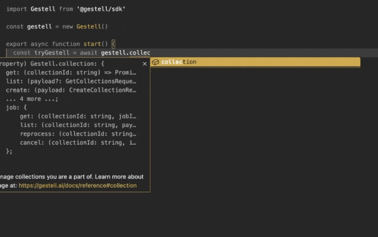

# Gestell Node SDK


[](https://coveralls.io/github/Gestell-AI/node-sdk?branch=master)
[](https://dl.circleci.com/status-badge/redirect/circleci/7sUmZuDYQ6cd8WbCiCCnfR/VPonbpR7NEQSaXxQngcCGW/tree/master)

A fully featured SDK with extensive code completion for interacting with the Gestell Platform. Compatible with both web and server side environments.



## Quick Start

First, get an API Key from <https://platform.gestell.ai>. Then install `@gestell/sdk`:

```bash
npm install @gestell/sdk
```

Or...

```bash
bun add @gestell/sdk
```

Second, load the API Key into your terminal session, or, pass it into the SDK:

```bash
# Load it into your terminal session
export GESTELL_API_KEY = "..."
```

```typescript
// Or, load it into the SDK library directly
import Gestell from '@gestell/sdk'

export const GESTELL_API_KEY = process.env.GESTELL_API_KEY || '...'
export const gestell = new Gestell({ key: GESTELL_API_KEY })
```

**Gestell will also read and load these environment variables from a `.env` file.**

Finally, start using the Gestell Platform SDK. The SDK can be used both on the client and server side. A public facing app should use it server side only due to the API Key being passed into the SDK and requests:

```typescript
// start.ts
import Gestell from '@gestell/sdk'

export const gestell = new Gestell()

export async function start() {
  const collections = await gestell.collection.list()
  console.log(collections)
}

start()
```

```bash
# Run your workflow
bun run start.ts
```

## Guides

You can review guides on common workflows and use cases for the Gestell Platform by going to <https://gestell.ai/docs>. Here are the most common use cases:

1. [Create a collection and upload documents to it](https://gestell.ai/docs/quick-start)

2. [Prompt a collection](https://gestell.ai/docs/prompt)

3. [Gather all labels from a collection](https://gestell.ai/docs/labels)

4. [Gather all tables from a collection](https://gestell.ai/docs/tables)

## Contributing

All workflows in the SDK use the [bun runtime](https://bun.sh/).

Opening an issue to address your concern is recommended. However, if you plan to submit a pull request (PR), please adhere to the following:

 1. **Align with the Repo Structure**: Organize canonical functionality within the appropriate folders. Provide clear documentation and usage annotations in the base class structures.

 2. **Pass All Unit Tests**: Ensure all `bun` unit tests pass and maintain near full code coverage.

 3. **Provide a Detailed PR Description**: Clearly outline the changes made and the specific issues they resolve in your pull request.

The workflow is as follows:

```bash
# Compile a new dist
bun run build

# Run unit tests
export GESTELL_API_URL="..." # If running on staging or locally
export GESTELL_API_KEY="..."
bun run test

# Verify and test the package externally with bun link
bun link

mkdir ../test
cd ../test
bun init
bun link @gestell/sdk
# ... Write test workflows
bun run index.ts
```
